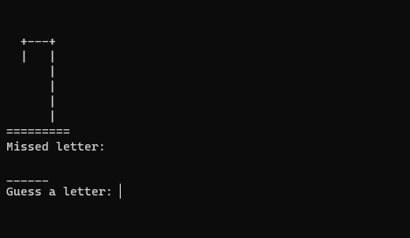
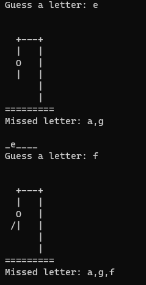

# Hanging Man Game

Welcome to the Hanging Man Game! This is a simple Python implementation of the classic word-guessing game.

## Table of Contents
- [Introduction](#introduction)
- [Features](#features)
- [Installation](#installation)
- [Usage](#usage)
- [Screenshots](#screenshots)
- [Contributing](#contributing)
- [License](#license)

## Introduction
The Hanging Man Game is a command-line based game where the player tries to guess a hidden word by suggesting letters. If the player suggests a letter that is in the word, it is revealed in its correct positions. If the player suggests a letter that is not in the word, a part of the hanging man is drawn. The game continues until the player guesses the word or the hanging man is fully drawn.

## Features
- Command-line interface
- Random word selection
- Keeps track of guessed letters
- Displays the hanging man as the game progresses

## Installation
To install and run the Hanging Man Game on your local machine, follow these steps:

1. Clone the repository:
 ```sh
 git clone https://github.com/noavisl/Hanging-man-game.git
 ```

2. Navigate to the project directory:
 ```sh
 cd Hanging-man-game
 ```

3. Ensure you have Python installed (the game is compatible with Python 3.x).

4. Run the game:
 ```sh
 python hanging_man.py
 ```

## Usage
Once the game starts, you will see a prompt to guess a letter. Type a letter and press Enter. The game will reveal the positions of the letter if it is in the word or draw a part of the hanging man if it is not. Keep guessing letters until you either guess the word correctly or the hanging man is fully drawn.

## The appearance of the game:
### Game Start:


### In-Game:


